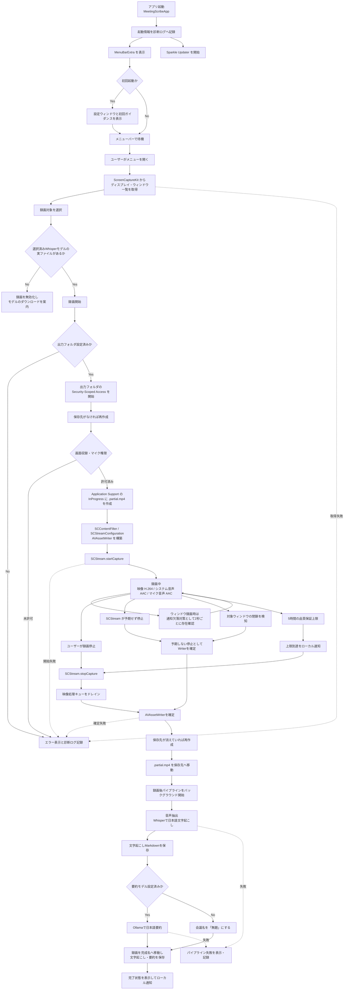
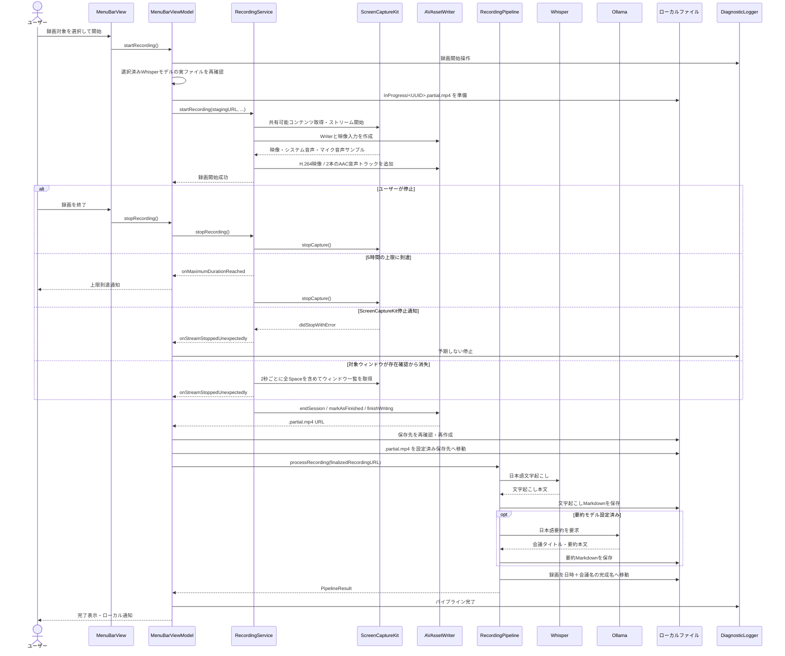

# アプリケーションライフサイクル

MeetingScribe の起動から録画、文字起こし、要約、ファイル保存までの流れを、実装に基づいてまとめます。

## 全体フロー



## コンポーネント間のシーケンス



## 各フェーズの責務

| フェーズ | 主な実装 | 責務 |
|---|---|---|
| 起動 | `MeetingScribeApp`、`FirstLaunchTriggerView` | メニューバー常駐、Sparkle開始、初回設定画面、通知権限要求 |
| 対象選択 | `MenuBarViewModel.loadShareableContent()` | 画面・ウィンドウ一覧の取得とUI用モデルへの変換 |
| 録画開始前 | `MenuBarViewModel.startRecording()` | 選択済みWhisperモデルの実ファイル、保存先、画面収録・マイク権限を確認し、作業ファイルのURLを準備 |
| 録画開始 | `RecordingService.startRecording()` | キャプチャフィルタ、解像度、SCStream、AVAssetWriterの構築 |
| 録画中 | `RecordingStreamOutput` | 映像とシステム音声・マイク音声のタイムスタンプ補正、H.264/AAC書き込み |
| ウィンドウ監視 | `RecordingService.pollWindowExistence()` | ScreenCaptureKit終了通知が来ない場合のフォールバックとして、2秒間隔で対象ウィンドウの存在を確認。別Spaceのウィンドウも存在対象に含める |
| 録画時間監視 | `RecordingService.stopAtMaximumDuration()` | 5時間で正常停止し、ユーザーへ品質保証上限の到達を通知 |
| 録画停止 | `RecordingService.stopRecording()` | キャプチャ停止、キューのドレイン、Writerの正常終了 |
| 予期しない停止 | `RecordingStreamDelegate`、`handleStreamStoppedUnexpectedly()` | システム側停止やウィンドウ閉鎖時にも録画ファイルを可能な限り確定 |
| 録画ファイル確定 | `MenuBarViewModel.finalizeRecording()` | 消えた保存先を再作成し、Application Supportの作業ファイルを設定済み保存先へ移動 |
| 後処理 | `RecordingPipeline.processRecording()` | 全音声トラックの合成、Whisper文字起こし、Ollama要約、録画・Markdownの完成名への移動・保存 |
| UI状態と通知 | `MenuBarViewModel` | 録画・パイプライン状態、エラー表示、完了通知 |
| 診断 | `DiagnosticLogger`、`DiagnosticLogStore` | OSLogとローカルファイルへ処理状態・エラーを記録 |

## 録画停止の経路

録画終了には4つの経路があります。

1. ユーザーによる手動停止
   - `SCStream.stopCapture()` を呼び、映像処理キューをドレインしてからWriterを確定します。
2. ScreenCaptureKitによる予期しない停止
   - `SCStreamDelegate.stream(_:didStopWithError:)` からWriter確定処理へ進みます。
3. 録画対象ウィンドウの存在確認によるフォールバック停止
   - ウィンドウ閉鎖時に `didStopWithError` が必ず通知されるとは限らないため、ウィンドウ録画時だけ2秒間隔で対象IDを確認します。
   - IDが見つからない場合は、予期しない停止と同じWriter確定処理へ進みます。
   - 一覧取得そのものが失敗した場合は録画を止めず、次回の確認で再試行します。
4. 5時間の品質保証上限による自動停止
   - 通常の `stopRecording()` を使ってファイルを正常終了し、手動停止と同じ後処理へ渡します。
   - 上限到達をユーザーへローカル通知します。

ウィンドウ存在確認は終了判定の主経路ではなく、ScreenCaptureKit終了通知の欠落を補うために残しています。`SCShareableContent.getExcludingDesktopWindows(false, onScreenWindowsOnly: false)` を使用するため、対象が別のSpaceに移動して画面上に見えていないだけの場合は閉鎖として扱いません。終了通知の挙動を再評価するときは、`scripts/check_window_close_signal.swift` で映像フレーム受信後の結果を確認します。

## 録画ファイルの保存場所と確定

録画中のファイルは設定済み保存先へ直接書かず、アプリのApplication Support配下へ一時保存します。

```text
~/Library/Application Support/MeetingScribe/InProgress/<UUID>.partial.mp4
```

Writerの正常終了後、設定済み保存先が録画中に削除されていれば同じパスへフォルダを再作成し、作業ファイルを `recording_<日時>.mp4` として移動します。その後、録画後パイプラインが同じ出力フォルダ内で日時と会議名を含む完成名へ移動します。長時間録画を複製しないため、いずれもコピーではなくファイル移動です。

正常に移動できて作業フォルダが空なら `InProgress` を削除します。移動失敗やアプリの異常終了で `.partial.mp4` が残った場合は自動削除せず、復旧可能な状態で保全します。

## 録画後パイプライン

作業ファイルを設定済み保存先へ移動できた時点で、UI上の新しい録画操作を妨げない独立した `Task` による後処理を開始します。録画開始前に選択済みWhisperモデルの実ファイルを必須とし、存在しない `default` モデルへのフォールバックは行いません。

1. 出力フォルダへのSecurity-Scoped Accessを取得
2. 録画のシステム音声・マイク音声をモノラルへ合成し、WAVをストリーミング抽出
3. 選択済みモデルでWhisper CLIを `-l ja` として実行し、日本語で文字起こし
4. 文字起こしMarkdownを先に保存
5. 要約モデルが設定されていれば、Ollamaへ日本語固定プロンプトで要約を要求
6. 日時と会議タイトルからファイル名を生成
7. 録画と文字起こしを完成名へ移動し、要約を出力フォルダへ保存
8. 完了状態をUIへ反映し、ローカル通知を送信

録画停止ごとに `PipelineJob` を追加し、文字起こし・要約・保存・完了・失敗の状態をメニューバーへ表示します。複数の録画後処理は独立したタスクとして並行実行され、実行中の全項目と直近5件の完了・失敗結果を確認できます。加えて、出力フォルダを走査して完成済み録画の日時・会議名・文字起こし/要約の有無を履歴表示し、項目からFinderで録画ファイルを開けます。失敗時は対象ジョブへエラーメッセージを表示し、診断ログへエラーのdomain、code、descriptionを残します。

## 診断ログ

診断ログは次の場所に保存されます。

```text
~/Library/Application Support/MeetingScribe/Logs/<bundle-id>.log
```

- Release: `com.shu-pf.MeetingScribe.log`
- Debug: `com.shu-pf.MeetingScribe.dev.log`
- 1ファイル最大5MB
- 3世代のバックアップを保持
- DEBUGレベルは性能への影響を避けるためOSLogのみに出力
- INFO、WARN、ERRORをローカルファイルへ永続保存
- 会議の文字起こし本文や要約本文は記録しない

設定画面の「診断ログ」からログファイルを直接開くか、Finderで表示できます。

## 調査時に確認するログ

録画が突然終了した場合は、該当時刻付近を次の順で確認します。

1. `[MenuBar] 録画開始操作`
2. `[Recording] 録画開始要求`
3. `[MenuBar] 録画中状態へ遷移` の `stagingURL` と `destinationURL`
4. `[Recording] 録画開始成功`
5. 停止理由
   - 手動停止: `[MenuBar] 録画停止操作`
   - ScreenCaptureKit通知: `[Recording] ストリームが停止しました`
   - ウィンドウ存在確認: `[Recording] 録画元ウィンドウが存在しない`
   - 5時間上限: `[Recording] 録画が5時間の品質保証上限に到達`
6. 予期しない停止の場合は `[Recording] handleStreamStoppedUnexpectedly`
7. `[MenuBar] 完成した録画を保存先へ移動`
8. `[Pipeline]` または `[MenuBar] 録画後パイプライン`

エラー行には可能な範囲でNSErrorのdomain、code、descriptionを含めます。
