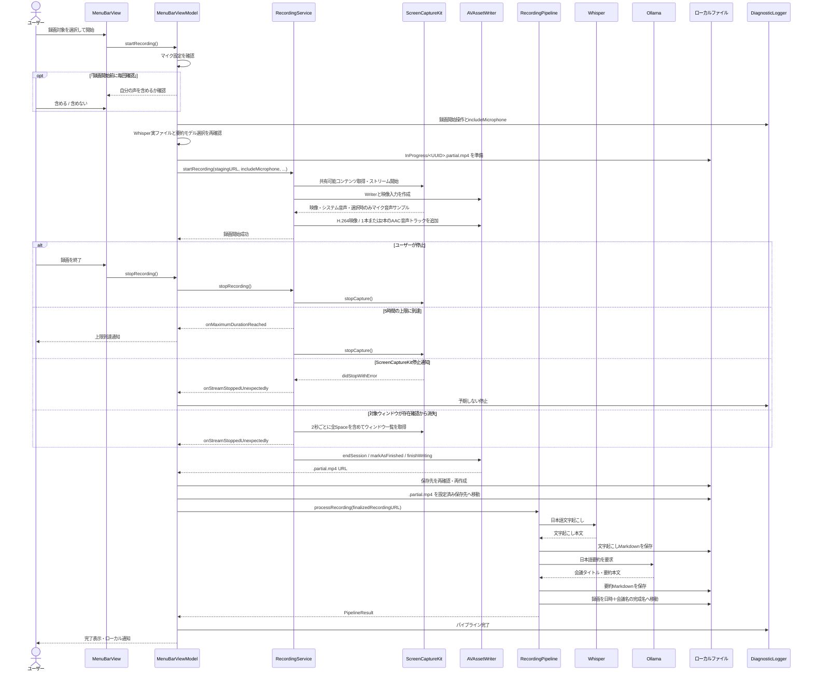

# アプリケーションライフサイクル

MeetingScribe の起動から録画、文字起こし、要約、ファイル保存までの流れを、実装に基づいてまとめます。

## 全体フロー

```mermaid
flowchart TD
    Launch["アプリ起動<br/>MeetingScribeApp"] --> AppLog["起動情報を診断ログへ記録"]
    AppLog --> MenuBar["MenuBarExtra を表示"]
    AppLog --> Sparkle["Sparkle Updater を開始"]
    MenuBar --> FirstLaunch{"初回起動か"}
    FirstLaunch -- Yes --> Settings["設定ウィンドウと<br/>必須セットアップを表示"]
    FirstLaunch -- No --> Idle["メニューバーで待機"]
    Settings --> SetupOutput["保存先を選択"]
    SetupOutput --> SetupPermissions["必須の画面収録権限と<br/>任意のマイク権限を確認"]
    SetupPermissions --> SetupWhisper["推奨Whisperモデル<br/>large-v3-turboをダウンロード"]
    SetupWhisper --> SetupOllama{"Ollamaが起動しているか"}
    SetupOllama -- No --> OllamaGuide["Ollamaのインストール・起動を案内"]
    OllamaGuide --> SetupOllama
    SetupOllama -- Yes --> SetupSummary["Macのメモリに応じたGemma 4を<br/>Ollama APIでダウンロード"]
    SetupSummary --> SetupComplete["両モデルを選択状態にして<br/>初期設定完了を保存"]
    SetupComplete --> Idle

    Idle --> OpenMenu["ユーザーがメニューを開く"]
    OpenMenu --> LoadContent["ScreenCaptureKit から<br/>ディスプレイ・ウィンドウ一覧を取得"]
    LoadContent --> SelectTarget["録画対象を選択"]
    LoadContent -. 取得失敗 .-> UIError["エラー表示と診断ログ記録"]

    SelectTarget --> WhisperCheck{"選択済みWhisperモデルの<br/>実ファイルがあるか"}
    WhisperCheck -- No --> WhisperGuide["録画を無効化し<br/>モデルのダウンロードを案内"]
    WhisperCheck -- Yes --> SummaryModelCheck{"要約モデルが<br/>選択済みか"}
    SummaryModelCheck -- No --> SummaryModelGuide["録画を無効化し<br/>要約モデルの設定を案内"]
    SummaryModelCheck -- Yes --> MicPreference{"マイク設定"}
    MicPreference -- 毎回確認 --> MicDialog["自分の声を含めるか確認"]
    MicPreference -- 常に含める --> WithMic["マイクあり"]
    MicPreference -- 常に含めない --> WithoutMic["マイクなし"]
    MicDialog -- 含める --> WithMic
    MicDialog -- 含めない --> WithoutMic
    WithMic --> OutputCheck{"出力フォルダ設定済みか"}
    WithoutMic --> OutputCheck
    OutputCheck -- No --> UIError
    OutputCheck -- Yes --> SecurityScope["出力フォルダの<br/>Security-Scoped Access を開始"]
    SecurityScope --> OutputPrepare["保存先がなければ再作成"]
    OutputPrepare --> Permissions{"必要な権限"}
    Permissions -- 画面収録未許可 --> UIError
    Permissions -- マイクあり・マイク未許可 --> MicPermission["マイク権限を要求"]
    MicPermission -- 拒否 --> UIError
    MicPermission -- 許可 --> Staging["Application Support の<br/>InProgress に .partial.mp4 を作成"]
    Permissions -- 画面収録許可・マイクなし --> Staging
    Staging --> CaptureSetup["SCContentFilter / SCStreamConfiguration<br/>AVAssetWriter を構築"]
    CaptureSetup --> Capture["SCStream.startCapture"]
    Capture -. 開始失敗 .-> UIError

    Capture --> Recording["録画中<br/>映像 H.264 / システム音声 AAC<br/>選択時のみマイク音声 AAC"]
    Recording --> WindowPoll["ウィンドウ録画時は<br/>通知欠落対策として2秒ごとに存在確認"]
    WindowPoll --> Recording

    Recording --> ManualStop["ユーザーが録画停止"]
    Recording --> StreamStop["SCStream が予期せず停止"]
    Recording --> WindowGone["対象ウィンドウの閉鎖を検知"]
    Recording --> DurationLimit["5時間の品質保証上限"]

    ManualStop --> StopCapture["SCStream.stopCapture"]
    DurationLimit --> LimitNotify["上限到達をローカル通知"]
    LimitNotify --> StopCapture
    StopCapture --> Drain["映像処理キューをドレイン"]
    StreamStop --> UnexpectedFinalize["予期しない停止としてWriterを確定"]
    WindowGone --> UnexpectedFinalize
    Drain --> Finalize["AVAssetWriterを確定"]
    UnexpectedFinalize --> Finalize
    Finalize -. 確定失敗 .-> UIError

    Finalize --> RecreateOutput["保存先が消えていれば再作成"]
    RecreateOutput --> MoveOutput[".partial.mp4 を保存先へ移動"]
    MoveOutput --> Pipeline["録画後パイプラインをバックグラウンド開始"]
    Pipeline --> PersistJob["ジョブ・モデル・保存先Bookmarkを<br/>Application Supportへ永続化"]
    PersistJob --> Transcribe["音声抽出<br/>Whisperで日本語文字起こし"]
    Transcribe --> Transcript["文字起こしチェックポイントと<br/>Markdownを保存"]
    Transcript --> Summarize["Ollamaで日本語要約"]
    Summarize --> SummaryCheckpoint["要約結果と完成名を<br/>チェックポイント保存"]
    SummaryCheckpoint --> Save["録画を完成名へ移動し<br/>文字起こし・要約を保存"]
    Save --> Notify["完了状態を表示してローカル通知"]
    Transcribe --> SystemSleep["システムスリープ"]
    Summarize --> SystemSleep
    SystemSleep --> Waiting["タスクをキャンセルし<br/>再開待ちとして永続化"]
    Waiting --> Wake["復帰・アプリ再起動"]
    Wake --> ResumeCheckpoint{"利用できる<br/>チェックポイント"}
    ResumeCheckpoint -- なし --> Transcribe
    ResumeCheckpoint -- 文字起こし済み --> Summarize
    ResumeCheckpoint -- 要約済み --> Save
    Transcribe -. 失敗 .-> PipelineError["パイプライン失敗を表示・記録"]
    Summarize -. 失敗 .-> PipelineError
```



## 初回必須セットアップ

`FirstLaunchTriggerView` は、初期設定完了フラグがない場合に設定ウィンドウを開きます。設定画面は `Window` シーンで1枚だけ生成し、初回案内とメニューバーの「設定を開く」が同時または繰り返し呼ばれても既存ウィンドウを前面へ戻します。`FirstLaunchGuidanceView` と `InitialSetupViewModel` が次の6ステップを順番に表示し、各ステップの必須条件を満たすまで「次へ」を無効にします。シートは操作で閉じられず、最後の完了操作を行ったときだけ `hasSeenFirstLaunchGuidance` を保存します。現在のステップもUserDefaultsへ保存するため、権限反映のための再起動やViewの再生成が発生しても途中から再開できます。

1. ローカル処理、必要容量、セットアップ内容の説明
2. 録画・文字起こし・要約の完成ファイルを置く保存先の選択
3. 必須の画面収録権限と、任意のマイク権限の確認
4. 推奨文字起こしモデル `large-v3-turbo` のダウンロードと選択
5. Ollamaのインストール・起動確認、推奨要約モデルのダウンロードと選択
6. 設定内容の確認とセットアップ完了

WhisperモデルはMeetingScribeのApplication Support配下へ保存します。要約モデルはOllamaの `POST /api/pull` をストリーミングで呼び出し、進捗を画面へ表示します。Ollamaの起動と導入済みモデルは `GET /api/tags` で確認します。Ollama本体がない場合は公式ダウンロード、Applicationsへの導入、初回起動を番号付きで案内します。インストール済みでAPIが停止している場合は、セットアップ画面からOllamaを起動できます。モデル取得時にOllamaから更新要求が返った場合は、英語のAPIエラーをそのまま表示せず、最新版の導入手順と公式ダウンロードへのリンクを日本語で表示します。

推奨要約モデルはGemma 4です。日本語を含む140以上の言語、長いコンテキスト、要約品質とローカル実行時の容量バランスを理由に、物理メモリ24GB以上では `gemma4:12b`（約7.6GB）、それ未満では量子化された軽量モデル `gemma4:e2b-it-qat`（約4.3GB）を選びます。

## コンポーネント間のシーケンス



## 各フェーズの責務

| フェーズ | 主な実装 | 責務 |
|---|---|---|
| 起動 | `MeetingScribeApp`、`FirstLaunchTriggerView` | メニューバー常駐、Sparkle開始、未完了なら初回必須セットアップを表示、通知権限要求 |
| 初回設定 | `FirstLaunchGuidanceView`、`InitialSetupViewModel` | 保存先・必須の画面収録権限・任意のマイク権限を確認し、推奨WhisperモデルとMacに応じたGemma 4を取得・選択するまで完了を許可しない |
| 対象選択 | `MenuBarViewModel.loadShareableContent()` | 画面・ウィンドウ一覧の取得とUI用モデルへの変換 |
| 録画開始前 | `MenuBarViewModel.startRecording()` | マイク設定を解決し、選択済みWhisperモデルの実ファイル、選択済み要約モデル、保存先、必要な権限を確認して作業ファイルのURLを準備 |
| 録画開始 | `RecordingService.startRecording()` | マイク選択に応じたキャプチャフィルタ、解像度、SCStream、AVAssetWriterの構築 |
| 録画中 | `RecordingStreamOutput` | 映像とシステム音声、選択時のみマイク音声のタイムスタンプ補正、H.264/AAC書き込み |
| ウィンドウ監視 | `RecordingService.pollWindowExistence()` | ScreenCaptureKit終了通知が来ない場合のフォールバックとして、2秒間隔で対象ウィンドウの存在を確認。別Spaceのウィンドウも存在対象に含める |
| 録画時間監視 | `RecordingService.stopAtMaximumDuration()` | 5時間で正常停止し、ユーザーへ品質保証上限の到達を通知 |
| 録画停止 | `RecordingService.stopRecording()` | キャプチャ停止、キューのドレイン、Writerの正常終了 |
| 予期しない停止 | `RecordingStreamDelegate`、`handleStreamStoppedUnexpectedly()` | システム側停止やウィンドウ閉鎖時にも録画ファイルを可能な限り確定 |
| 録画ファイル確定 | `MenuBarViewModel.finalizeRecording()` | 消えた保存先を再作成し、Application Supportの作業ファイルを設定済み保存先へ移動 |
| 後処理 | `RecordingPipeline.processRecording()` | 全音声トラックの合成、Whisper文字起こし、Ollama要約、チェックポイント、録画・Markdownの完成名への移動・保存 |
| 後処理の復旧 | `PipelineJobStore`、`MenuBarViewModel` | ジョブと保存先Bookmarkを永続化し、スリープ・終了・クラッシュ後に未完了フェーズから再開 |
| 録画履歴 | `RecordingHistoryStore`、`MenuBarViewModel` | 録画ごとの履歴JSONとファイルBookmarkをApplication Supportへ永続化し、保存先変更後も過去の録画を表示 |
| UI状態と通知 | `MenuBarViewModel` | 録画・パイプライン状態、エラー表示、完了通知 |
| 診断 | `DiagnosticLogger`、`DiagnosticLogStore` | OSLogとローカルファイルへ処理状態・エラーを記録 |

## 録画停止の経路

録画終了には4つの経路があります。

1. ユーザーによる手動停止
   - `SCStream.stopCapture()` を呼び、映像処理キューをドレインしてからWriterを確定します。
2. ScreenCaptureKitによる予期しない停止
   - `SCStreamDelegate.stream(_:didStopWithError:)` からWriter確定処理へ進みます。
3. 録画対象ウィンドウの存在確認によるフォールバック停止
   - ウィンドウ閉鎖時に `didStopWithError` が必ず通知されるとは限らないため、ウィンドウ録画時だけ2秒間隔で対象IDを確認します。
   - IDが見つからない場合は、予期しない停止と同じWriter確定処理へ進みます。
   - 一覧取得そのものが失敗した場合は録画を止めず、次回の確認で再試行します。
4. 5時間の品質保証上限による自動停止
   - 通常の `stopRecording()` を使ってファイルを正常終了し、手動停止と同じ後処理へ渡します。
   - 上限到達をユーザーへローカル通知します。

ウィンドウ存在確認は終了判定の主経路ではなく、ScreenCaptureKit終了通知の欠落を補うために残しています。`SCShareableContent.getExcludingDesktopWindows(false, onScreenWindowsOnly: false)` を使用するため、対象が別のSpaceに移動して画面上に見えていないだけの場合は閉鎖として扱いません。終了通知の挙動を再評価するときは、`scripts/check_window_close_signal.swift` で映像フレーム受信後の結果を確認します。

## 録画ファイルの保存場所と確定

録画中のファイルは設定済み保存先へ直接書かず、アプリのApplication Support配下へ一時保存します。

```text
~/Library/Application Support/MeetingScribe/InProgress/<UUID>.partial.mp4
```

Writerの正常終了後、設定済み保存先が録画中に削除されていれば同じパスへフォルダを再作成し、作業ファイルを `recording_<日時>.mp4` として移動します。その後、録画後パイプラインが同じ出力フォルダ内で日時と会議名を含む完成名へ移動します。長時間録画を複製しないため、いずれもコピーではなくファイル移動です。

正常に移動できて作業フォルダが空なら `InProgress` を削除します。移動失敗やアプリの異常終了で `.partial.mp4` が残った場合は自動削除せず、復旧可能な状態で保全します。

## 録画履歴

録画履歴は現在の保存先フォルダを表示のたびに走査せず、録画後パイプラインの完了時に録画単位のJSONとして永続化します。

```text
~/Library/Application Support/MeetingScribe/RecordingHistory/
├── Records/
│   └── <録画ジョブID>.json
└── legacy-output-folder-import-v1
```

各レコードには安定したUUID、録画日時、会議名、録画・文字起こし・要約のパスとSecurity-Scoped Bookmarkを保存します。新しい保存先を選んだ場合も既存レコードは変更せず、新しい録画だけを新しい保存先へ記録します。そのため、保存先変更前後の録画を同じ履歴に表示できます。

初回移行時だけ、設定中の保存先から完成名の録画と対応するMarkdownを読み取り、履歴レコードへ変換します。移行完了マーカーにより同じフォルダを繰り返し取り込みません。録画ファイルがFinderなどから削除された場合はレコードを自動削除せず「ファイルなし」として表示し、ユーザーが履歴メタデータだけを削除できます。

## 録画後パイプライン

作業ファイルを設定済み保存先へ移動できた時点で、UI上の新しい録画操作を妨げない独立した `Task` による後処理を開始します。録画開始前に選択済みWhisperモデルの実ファイルと選択済み要約モデルを必須とし、存在しない `default` モデルへのフォールバックや要約のスキップは行いません。

ジョブは開始前に `PipelineJobStore` へ保存します。保存内容はジョブID、録画パス、録画日時、録画時点で選択されていたWhisper/Ollamaモデル、保存先パスとSecurity-Scoped Bookmark、現在フェーズです。設定が後から変更されても、未完了ジョブは録画時点のモデルと保存先で再開します。

```text
~/Library/Application Support/MeetingScribe/PipelineJobs/
├── Manifests/<ジョブID>.json
└── Work/<ジョブID>/
    ├── transcript.txt
    ├── summary.json
    └── whisper.pid（Whisper実行中のみ）
```

1. 出力フォルダへのSecurity-Scoped Accessを取得
2. 録画の全音声トラック（システム音声、選択時のみマイク音声）をモノラルへ合成し、WAVをストリーミング抽出
3. 選択済みモデルでWhisper CLIを `-l ja` として実行し、日本語で文字起こし
4. 文字起こし本文をチェックポイントへ保存し、固有ジョブID付きの文字起こしMarkdownも先に保存
5. Ollamaから選択済みモデルのコンテキスト長を取得
6. 文字起こしが安全な入力長を超える場合は部分要約し、必要に応じて中間要約も再分割して段階的に統合
7. 統合した会議内容を日本語固定プロンプトで最終要約
8. 日時と会議タイトルから重複しない完成ファイル名を生成し、要約結果と一緒にチェックポイントへ保存
9. 録画と文字起こしを完成名へ移動し、要約を出力フォルダへ保存
10. 完了状態をUIへ反映し、ローカル通知を送信
11. 完了後、文字起こし本文と要約本文を含む作業チェックポイントを削除

macOSは蓋を閉じるとシステム自体がスリープするため、閉じている間の処理継続は保証しません。`NSWorkspace.willSleepNotification` を受けるとWhisperプロセスとOllama通信をキャンセルし、ジョブを再開待ちとして永続化します。`NSWorkspace.didWakeNotification` ではキャンセル完了を待ってから同じジョブIDを1回だけ再開します。

アプリ終了やクラッシュで通知処理を完了できなかった場合も、起動時に `waiting`、`transcribing`、`summarizing`、`saving` のジョブをすべて再開待ちへ正規化します。`transcript.txt` があればWhisperを省略し、`summary.json` があればOllamaを省略して保存から再開します。完成ファイル名も要約チェックポイント内で確定済みなので、保存中断後の再実行で別名ファイルや重複ファイルを作りません。

Whisper起動中はジョブ作業領域へPIDを記録します。アプリが強制終了すると子プロセスだけが残る場合があるため、再開時はPIDの実行パスが現在のアプリバンドル内のWhisperと完全一致することを確認し、そのプロセスだけを停止してから再実行します。PIDが別プロセスへ再利用されていた場合は停止しません。

設定画面では最大コンテキスト長をユーザーに指定させません。`SummaryService` がOllamaの `POST /api/show` からモデル固有のコンテキスト長を取得し、プロンプトと生成出力の予約領域を差し引いた安全なUTF-8バイト数で入力を分割します。各部分は独立して要点化し、その合計がまだ上限を超える場合も再度グループ化・圧縮するため、会議時間や文字起こし量によって入力長超過エラーをユーザーへ返さない構造です。ローカルで同一モデルを並列実行するとメモリ競合が起きやすいため、部分要約は順次実行します。

録画停止ごとに `PipelineJob` を追加し、文字起こし・要約・保存・完了・失敗の状態をメニューバーへ表示します。複数の録画後処理は独立したタスクとして並行実行され、実行中の全項目と直近5件の完了・失敗結果を確認できます。加えて、出力フォルダを走査して完成済み録画の日時・会議名・文字起こし/要約の有無を履歴表示し、項目からFinderで録画ファイルを開けます。失敗時は対象ジョブへエラーメッセージを表示し、診断ログへエラーのdomain、code、descriptionを残します。

## 診断ログ

診断ログは次の場所に保存されます。

```text
~/Library/Application Support/MeetingScribe/Logs/<bundle-id>.log
```

- Release: `com.shu-pf.MeetingScribe.log`
- Debug: `com.shu-pf.MeetingScribe.dev.log`
- 1ファイル最大5MB
- 3世代のバックアップを保持
- DEBUGレベルは性能への影響を避けるためOSLogのみに出力
- INFO、WARN、ERRORをローカルファイルへ永続保存
- 会議の文字起こし本文や要約本文は記録しない

設定画面は、内容を開く前に推測できるよう「録画」「AIモデル」「起動・更新」「ログ・情報」の4タブに分けます。診断ログは「ログ・情報」タブからログファイルを直接開くか、Finderで表示できます。

## 調査時に確認するログ

録画が突然終了した場合は、該当時刻付近を次の順で確認します。

1. `[MenuBar] 録画開始操作`
2. `[Recording] 録画開始要求`
3. `[MenuBar] 録画中状態へ遷移` の `stagingURL` と `destinationURL`
4. `[Recording] 録画開始成功`
5. 停止理由
   - 手動停止: `[MenuBar] 録画停止操作`
   - ScreenCaptureKit通知: `[Recording] ストリームが停止しました`
   - ウィンドウ存在確認: `[Recording] 録画元ウィンドウが存在しない`
   - 5時間上限: `[Recording] 録画が5時間の品質保証上限に到達`
6. 予期しない停止の場合は `[Recording] handleStreamStoppedUnexpectedly`
7. `[MenuBar] 完成した録画を保存先へ移動`
8. `[Pipeline]` または `[MenuBar] 録画後パイプライン`

エラー行には可能な範囲でNSErrorのdomain、code、descriptionを含めます。
