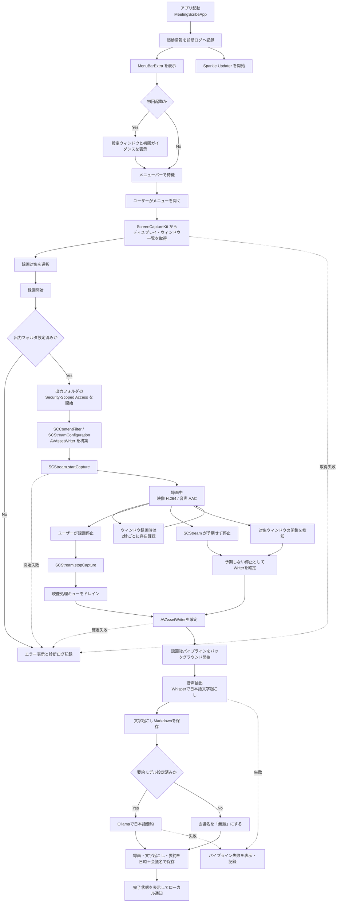
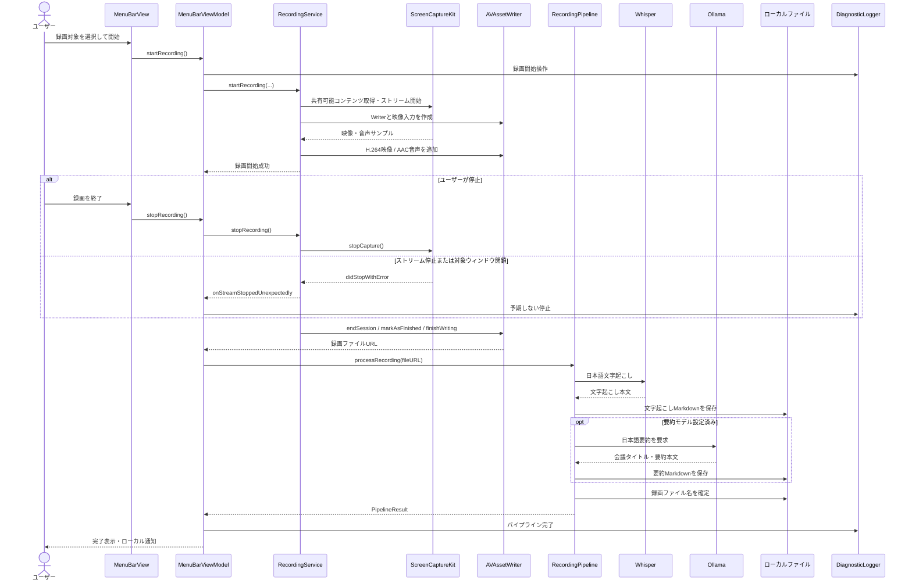

# アプリケーションライフサイクル

MeetingScribe の起動から録画、文字起こし、要約、ファイル保存までの流れを、実装に基づいてまとめます。

## 全体フロー



## コンポーネント間のシーケンス



## 各フェーズの責務

| フェーズ | 主な実装 | 責務 |
|---|---|---|
| 起動 | `MeetingScribeApp`、`FirstLaunchTriggerView` | メニューバー常駐、Sparkle開始、初回設定画面、通知権限要求 |
| 対象選択 | `MenuBarViewModel.loadShareableContent()` | 画面・ウィンドウ一覧の取得とUI用モデルへの変換 |
| 録画開始 | `RecordingService.startRecording()` | キャプチャフィルタ、解像度、SCStream、AVAssetWriterの構築 |
| 録画中 | `RecordingStreamOutput` | 映像と音声のタイムスタンプ補正、H.264/AAC書き込み |
| ウィンドウ監視 | `RecordingService.pollWindowExistence()` | 2秒間隔で対象ウィンドウの存在を確認。別Spaceのウィンドウも存在対象に含める |
| 録画停止 | `RecordingService.stopRecording()` | キャプチャ停止、キューのドレイン、Writerの正常終了 |
| 予期しない停止 | `RecordingStreamDelegate`、`handleStreamStoppedUnexpectedly()` | システム側停止やウィンドウ閉鎖時にも録画ファイルを可能な限り確定 |
| 後処理 | `RecordingPipeline.processRecording()` | Whisper文字起こし、Ollama要約、録画・Markdown保存 |
| UI状態と通知 | `MenuBarViewModel` | 録画・パイプライン状態、エラー表示、完了通知 |
| 診断 | `DiagnosticLogger`、`DiagnosticLogStore` | OSLogとローカルファイルへ処理状態・エラーを記録 |

## 録画停止の経路

録画終了には3つの経路があります。

1. ユーザーによる手動停止
   - `SCStream.stopCapture()` を呼び、映像処理キューをドレインしてからWriterを確定します。
2. ScreenCaptureKitによる予期しない停止
   - `SCStreamDelegate.stream(_:didStopWithError:)` からWriter確定処理へ進みます。
3. 録画対象ウィンドウの閉鎖
   - 2秒間隔の存在確認でウィンドウIDが見つからない場合、予期しない停止と同じ処理へ進みます。

ウィンドウ存在確認は `onScreenWindowsOnly: false` を使用します。対象が別のSpaceに移動して画面上に見えていないだけの場合は、閉鎖として扱いません。

## 録画後パイプライン

録画ファイルが確定すると、UI上の新しい録画操作を妨げない独立した `Task` で後処理を開始します。

1. 出力フォルダへのSecurity-Scoped Accessを取得
2. 録画からWAVを抽出
3. Whisper CLIを `-l ja` で実行し、日本語で文字起こし
4. 文字起こしMarkdownを先に保存
5. 要約モデルが設定されていれば、Ollamaへ日本語固定プロンプトで要約を要求
6. 日時と会議タイトルからファイル名を生成
7. 録画、文字起こし、要約を出力フォルダへ保存
8. 完了状態をUIへ反映し、ローカル通知を送信

録画停止ごとに `PipelineJob` を追加し、文字起こし・要約・保存・完了・失敗の状態をメニューバーへ表示します。複数の録画後処理は独立したタスクとして並行実行され、実行中の全項目と直近5件の完了・失敗結果を確認できます。加えて、出力フォルダを走査して完成済み録画の日時・会議名・文字起こし/要約の有無を履歴表示し、項目からFinderで録画ファイルを開けます。失敗時は対象ジョブへエラーメッセージを表示し、診断ログへエラーのdomain、code、descriptionを残します。

## 診断ログ

診断ログは次の場所に保存されます。

```text
~/Library/Application Support/MeetingScribe/Logs/<bundle-id>.log
```

- Release: `com.shu-pf.MeetingScribe.log`
- Debug: `com.shu-pf.MeetingScribe.dev.log`
- 1ファイル最大5MB
- 3世代のバックアップを保持
- DEBUGレベルは性能への影響を避けるためOSLogのみに出力
- INFO、WARN、ERRORをローカルファイルへ永続保存
- 会議の文字起こし本文や要約本文は記録しない

設定画面の「診断ログ」からログファイルを直接開くか、Finderで表示できます。

## 調査時に確認するログ

録画が突然終了した場合は、該当時刻付近を次の順で確認します。

1. `[MenuBar] 録画開始操作`
2. `[Recording] 録画開始要求`
3. `[Recording] 録画開始成功`
4. `[Recording] ストリームが停止しました` または `録画元ウィンドウが存在しない`
5. `[Recording] handleStreamStoppedUnexpectedly`
6. `[MenuBar] 録画ストリームが予期せず停止`
7. `[Pipeline]` または `[MenuBar] 録画後パイプライン`

エラー行には可能な範囲でNSErrorのdomain、code、descriptionを含めます。
